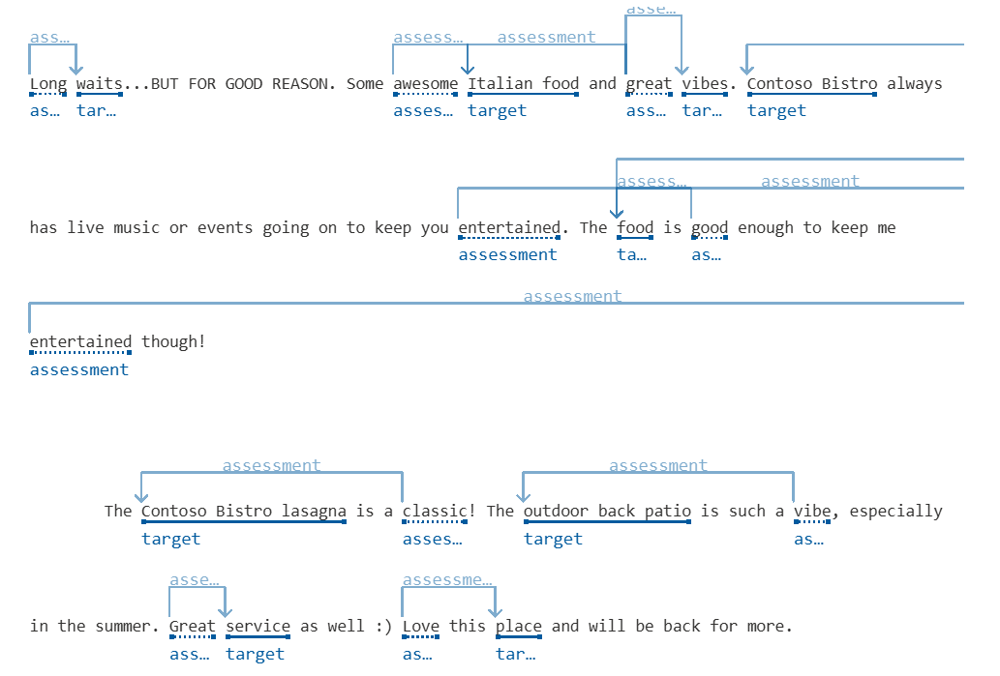
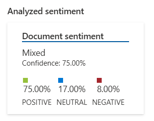
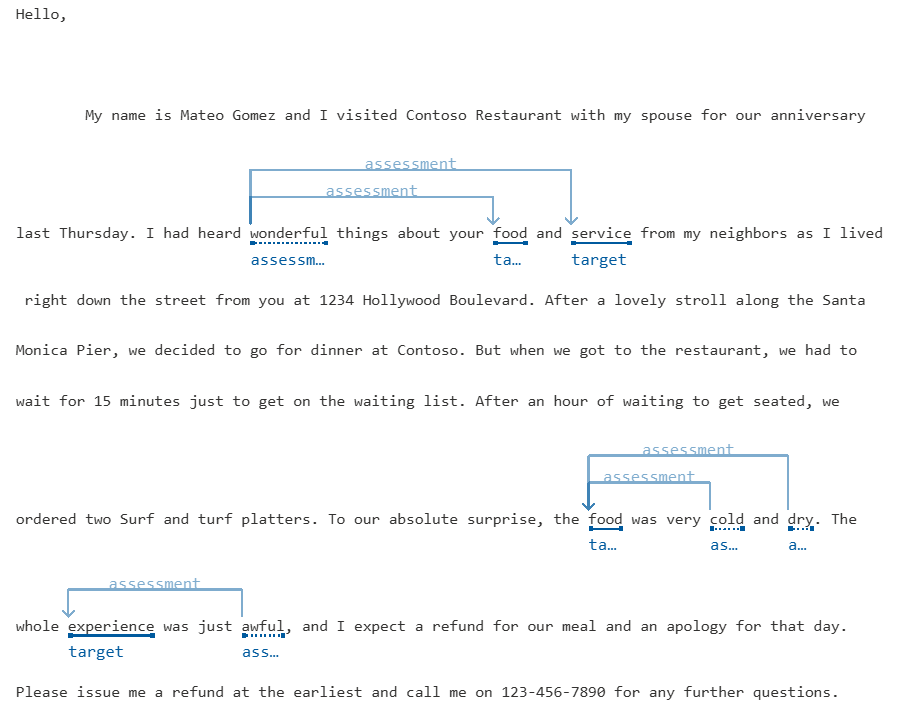
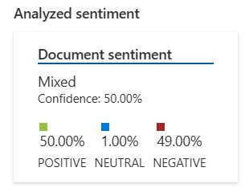
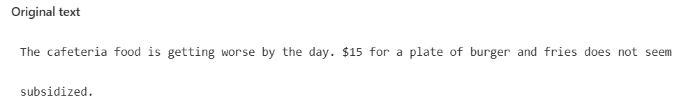
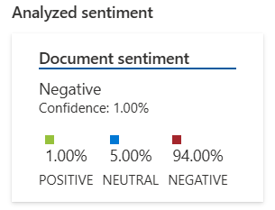

# Sentiment Analysis

 

## Exemplo 1

_Long waits...BUT FOR GOOD REASON. Some awesome Italian food and great vibes. Contoso Bistro always has live music or events going on to keep you entertained. The food is good enough to keep me entertained though!  
The Contoso Bistro lasagna is a classic! The outdoor back patio is such a vibe, especially in the summer. Great service as well :) Love this place and will be back for more._

**Análise:**

**Resultado:**

**Insights:**

Mesmo começando com uma observação negativa sobre a espera, o comentário mantém um tom positivo, destacando a qualidade da comida e o ambiente agradável.
Palavras de transição como "but" e "though" ajudam a equilibrar o tom da mensagem, tornando-a mais otimista. Além disso, expressões informais e emojis contribuem para reforçar o entusiasmo do cliente.
Isso demonstra como a análise de sentimentos pode ajudar empresas a interpretar melhor as avaliações dos clientes e identificar aspectos positivos, mesmo em comentários mistos.

 
 

## Exemplo 2

_My name is Mateo Gomez and I visited Contoso Restaurant with my spouse for our anniversary last Thursday. I had heard wonderful things about your food and service from my neighbors as I lived right down the street from you at 1234 Hollywood Boulevard.  
After a lovely stroll along the Santa Monica Pier, we decided to go for dinner at Contoso. But when we got to the restaurant, we had to wait for 15 minutes just to get on the waiting list. After an hour of waiting to get seated, we ordered two Surf and turf platters. To our absolute surprise, the food was very cold and dry.  
The whole experience was just awful, and I expect a refund for our meal and an apology for that day. Please issue me a refund at the earliest and call me on 123-456-7890 for any further questions._

**Análise:**

**Resultado:**

**Insights:**

Esse comentário tem um tom predominantemente negativo, evidenciado pela frustração do cliente ao relatar sua experiência.
Inicialmente, há uma expectativa positiva baseada em recomendações anteriores, mas a demora no atendimento e a insatisfação com a comida transformam a percepção para algo completamente negativo.
Palavras como "awful" e exigências diretas de reembolso demonstram um alto nível de insatisfação. Para empresas, esse tipo de feedback pode ser essencial para identificar problemas operacionais e melhorar a experiência do cliente.
 
 

# Exemplo 3

_The cafeteria food is getting worse by the day. $15 for a plate of burger and fries does not seem subsidized._

**Análise:**

**Resultado:**

**Insights:**

O comentário expressa insatisfação de maneira direta, tanto com a qualidade da comida quanto com o preço cobrado.
A frase "getting worse by the day" indica uma piora contínua, reforçando o sentimento negativo. Além disso, a menção ao preço sugere que o cliente esperava um valor mais acessível, possivelmente devido a um subsídio que não foi percebido.
Essa análise pode ser útil para empresas ajustarem preços e melhorarem a qualidade do serviço, além de ajudar sistemas de IA a detectarem críticas relacionadas a custo-benefício.
